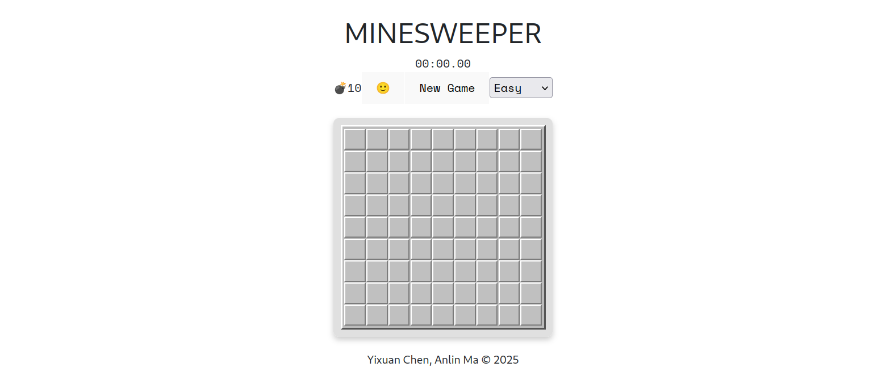

# Minesweeper Game - React Implementation

github repo: [https://github.com/CocoNautty/React-Minesweeper](https://github.com/CocoNautty/React-Minesweeper)

deployed page: [https://coconautty.github.io/React-Minesweeper/](https://coconautty.github.io/React-Minesweeper/)




## Project Overview

This project is a modern React implementation of the classic Minesweeper game. Players must clear a board containing hidden mines without detonating any of them, using numerical clues about the number of neighboring mines. The game features multiple difficulty levels, a timer, and a leaderboard system for tracking high scores.

- **Complete Minesweeper gameplay mechanics**:
  - Left-click to reveal cells
  - Right-click to flag potential mines
  - Cascade revealing of empty cells
  - First-click protection (first click is never a mine)
- **Multiple difficulty levels**: Easy (9×9, 10 mines), Medium (16×16, 40 mines), Hard (30×16, 99 mines), and Custom
- **Real-time timer** with millisecond precision
- **Flag counter** showing remaining unflagged mines
- **Leaderboard system** that saves and displays high scores by difficulty level triggered by clicking on the title 'MINESWEEPER'
- **Game state management** with win/lose detection and appropriate feedback
- **Visual feedback** for all game actions
- **Responsive design** with desktop focus

## Project Structure and Key Components

## Core Files and Directories

```text
src/
├── components/       # UI Components
│   ├── Board/        # Game board implementation
│   ├── ControlPanel/ # Game controls
│   ├── Tile/         # Individual cell implementation
│   ├── Timer/        # Game timer
│   ├── Modals/       # Win/lose modals
│   └── Scoreboard/   # Leaderboard implementation
├── context/          # React Context for state management
├── utils/            # Helper functions
└── constants/        # Game constants and settings
```

## Key Files to Focus On

1. **Game Logic and State Management**:
   - `src/context/GameProvider.jsx`: The heart of the game containing the reducer with all game actions and state management
   - `src/utils/boardGenerator.js`: Handles board creation with mine placement
   - `src/utils/cellReveal.js`: Implements the recursive revealing logic
2. **UI Components**:
   - `src/components/Board/Board.jsx` & `Board.css`: The game grid renderer
   - `src/components/Tile/Tile.jsx` & `Tile.css`: Individual cell component with styling
   - `src/components/ControlPanel/ControlPanel.jsx`: Contains game controls
   - `src/components/Modals/WinModal.jsx` & `LoseModal.jsx`: Game outcome modals
3. **Supporting Functionality**:
   - `src/components/Scoreboard/Scoreboard.jsx`: Leaderboard component
   - `src/components/Timer/Timer.jsx`: Game timer implementation
   - `src/utils/formatTime.js`: Formats timer display
   - `src/constants/difficulties.jsx`: Defines game difficulty presets

## Achievements

- Successfully implemented a fully functional Minesweeper game with intuitive controls
- Created a clean component architecture with separation of concerns
- Implemented complex game logic including recursive cell revealing
- Built a responsive UI with appropriate visual feedback
- Built a simple flask back-end API to store and retrieve data for leaderboard functionality
- Added multiple difficulty levels with custom game options

## Limitations and Challenges

1. **Mobile Support**: The game requires right-clicking for flagging mines, which isn't possible on most mobile devices. We added a warning message for mobile users rather than implementing an alternative interaction method.
2. **Game State Management**: Managing the complex state transitions and recursive cell revealing was challenging. We used React's Context API with useReducer for state management.
3. **Leaderboard Integration**: Connecting to the external API required handling asynchronous operations and error states.
4. **First-Click Safety**: Ensuring the first click is never a mine required careful board regeneration logic.
5. **Performance Optimization**: For larger board sizes (Hard difficulty), there are occasional performance issues when revealing large areas.

## Future Improvements

1. **Mobile Support**: Implement alternative interaction methods (long press for flagging).
2. **Offline Mode**: Add local storage support for offline play.
3. **Themes**: Implement visual themes (classic, modern, dark mode).
4. **Advanced Game Modes**: Add timed challenges or daily puzzles.
5. **Accessibility Improvements**: Enhance keyboard navigation and screen reader support.
6. **Sound Effects**: Add audio feedback for game actions.
7. **Performance Optimization**: Further optimize board generation and cell revealing for extremely large custom boards.

## Setup and Running the Project

1. Clone the repository
2. Install dependencies with `npm install`
3. Run the development server with `npm run dev`
4. Open your browser to the displayed local URL (typically `http://localhost:5173`)

## Credits

Developed by Yixuan Chen and Anlin Ma © 2025

## Note to Graders

When evaluating this project, we recommend focusing on:

1. The game reducer logic in `src/context/GameProvider.jsx` which handles all game state transitions
2. The core utility functions in `src/utils/` which implement the game mechanics
3. The `Tile` and `Board` components which demonstrate the UI implementation
4. The win/lose detection and modal implementation

The most complex parts of the implementation are the recursive cell revealing algorithm in `cellReveal.js` and the game state management in `GameProvider.jsx`.
